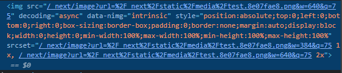

요번에 개발하게 된 프로젝트는 반응형 웹사이트였다. 이 과정에서 이미지 사이즈 최적화를 적용하게 되었는데, 리서치하다보니 몰랐던 것들을 좀 알게되어서 정리해본다.
WEBP등의 형식을 이용한 최적화와 압축을 통한 최적화도 있지만, 요기서는 반응형 사이트에서 최적의 이미지 사이즈를 설정하는 것만을 이야기하려고 한다. 다른 방법은 직접 적용하지 않았기도 하고!

## 왜 이미지 최적화??

사이트를 최적화 하는 방법은 여러가지가 있지만, 이미지를 빼놓을 수는 없다.
사이트 사이즈의 [75%를 차지한다는 얘기](https://almanac.httparchive.org/en/2019/page-weight)도 있고, 대부분의 사이트에서 [이미지가 LCP](https://web.dev/i18n/ko/optimize-lcp/)이기 때문에 사용성에도 큰 영향을 미친다.

반응형이 아닌 경우 이미지의 사이즈를 하나 또는 두개 정도로 가져갈 수 있겠지만, 반응형이고 이미지의 사이즈가 매우 가변적이라면 이미지 사이즈를 반응형에 따라 최적화 하는 것이 사이트 최적화에 큰 영향을 줄 수 있다.

## 반응형에 따른 사이즈 최적화

> 클라이언트 사이트에서 반응형에 따라 다른 크기의 이미지를 가져오는 것을 중점적으로 볼 것이당.
> 즉, 그 다른 크기의 이미지를 어떻게 생성하고 제공할지는 서비스마다 다를 수 있다. nextjs의 경우 [sharp](https://github.com/lovell/sharp) 를 사용하여 특정 parameter (`w750` 등)를 넘겨주면 그 사이즈에 맞춰 최적화해서 내려준다.
> 개발한 프로젝트도 사내에서 제공하는 이미지 인프라가 있어 위와 같은 방식으로 `w750`과 같이 타입을 붙여 처리했다.

HTML을 통해 반응형 이미지를 제공하는 기법은 두 가지가 있다. srcset과 picture/source 가 있다.

### srcset

일반적으로 동일한 이미지를 크기가 다르게 보여주고 싶은 경우에는 `srcset` 속성을 사용한다. 후술할 `picture` 는 보통 [아트디렉션](https://web.dev/codelab-art-direction/) 을 위해 사용한다.
사실 `picture/source`에서도 `srcset` 에서 제공하는 기능들을 미디어쿼리를 통해 제공할 수 있고 개인적으로 조금 더 사용하기 쉽고 직관적이라 왜 `srcset` 을 선호하는지 알지 못했는데, `srcset` 을 사용하면 브라우저가 여러 요인들을 고려해 (pixel ratio 등) 가장 알맞은 사이즈를 제공해준다. (참고: https://dev.opera.com/articles/native-responsive-images/)

브라우저가 직접 그 요인들을 계산해준다는건 장점이 될 수 있다. 추후 브라우저의 로직이 더 발전하게 되면 별도의 코드 수정 없이 그 이점을 누릴 수 있게된다. 만약 아트디렉션이 필요한 경우거나 특정한 device 사이즈에서 꼭 그 사이즈 제공이 필요한 경우가 아니면 srcset을 이용하는게 좋다.

`srcset`은 이미지 소스의 후보들을 나열해주는 것으로 적용할 수 있다. 요런식으로 사용하면 된다.

```tsx
// 참고: JSX 문법

```

> imgur에서 사이즈를 다르게 가져오는 방법으로 적용하였다.
> https://i.imgur.com/9ZC02Os.jp 라는 이미지 기준으로 뒤에 붙이는 b,m,l 에 따라 다른 사이즈를 가져온다.
> b - 150
> m - 320
> l - 640

요걸 풀어서 쓰면

`srcSet` - 이미지 소스의 후부와 그 이미지의 실제 사이즈를 작성한다.
`sizes` - 미디어 조건문과 그 미디어 조건문에서 이미지를 어떤 사이즈로 제공할지 작성한다.
`src` - 아무것도 매칭되지 않거나 srcset 미지원 브라우저에서 fallback 처리

이렇게 작성하게 되면 브라우저는 현재 화면의 크기를 파악하여 해당 하는 미디어 조건문에서 제공이 필요한 이미지 랜더링 크기를 파악하고, 그 크기에 가장 맞는 이미지 소스를 적용하게 된다.
예를들어 일반적인 경우 현재 디바이스 크기가 `320px` 이면 랜더링하는 이미지영역의 크기는 `sizes` 에서 두번째 미디어 조건문에 해당하는 300px이 될 것이고 가장 적합하는 https://i.imgur.com/9ZC02Osm.jpg 를 가져와서 적용할 것이다.

다만 위에서 말했듯이 브라우저는 여러 요인을 파악하기 때문에 다르게 적용될 수도 있다. 예를들어, 위와 동일한 조건임에도 pixel ratio가 2라고 가정하면 300px 영역에 적합한 이미지는 https://i.imgur.com/9ZC02Osl.jpg 가 되어 이 이미지가 적용될 수 있다.

만약 이미지 크기가 반응형에 따라 변하지 않고 해상도만 조절하고 싶다면 이렇게 작성할 수도 있다.

```tsx

```

요렇게 정의하면 이 이미지는 pixel ratio에 따라 알맞은 이미지를 보여준다.

### picture

`picture` 와 `source`를 사용하여도 반응형 처리를 할 수 있다.

<picture> 는 랜더링되는 요소는 아니고 내부에 <source> 엘리먼트를 가지며 이 엘리먼트에 적용된 요소들을 통해 어떤 이미지를 보여 줄 지 결정한다.

<source>는 특정 미디어 조건문에 해당하는 소스를 정의한다. 여기도 srcset과 sizes를 적용할 수 있긴한데, 굳이 이 둘을 조합해서 사용할일이 많지는 않을 것이라고 생각한다.

그래서 요렇게 사용할 수 있다.

```tsx
<picture>
  <source media="(max-width: 240px)" srcSet="https://i.imgur.com/9ZC02Osb.jpg" />
  <source media="(max-width: 400px)" srcSet="https://i.imgur.com/9ZC02Osm.jpg" />
  
</picture>
```

이런식으로 특정 디바이스 크기에서 사용할 이미지 소스를 명시적으로 지정할 수 있다.
위에서 부터 source의 media 조건문을 파악하고 참인 조건을 만나면 바로 해당 이미지 소스를 제공하고 아래쪽으로는 내려가지 않는다.

만약 모두 해당하지 않거나, 브라우저가 picture/source를 지원하지 않으면 가장 하위에 있는  가 제공된다.
(즉, srcset 과 picture 모두 하위 브라우저 호환성을 고려할 필요는 없다.)

srcset과 다르게 특정 미디어에서 제공할 이미지를 명시적으로 작성한다. 그렇기 때문에 위와 같이만 작성하면 pixel ratio는 고려되지 않는다.
요걸 고려하고 싶으면 media 쿼리를 그렇게 업데이트 할 수도 있겠지만, 그냥 srcset을 사용하는게 낫다.

srcset을 사용할 수 없는 상황이라면 애초에 retina를 기준으로 이미지를 가져오는게 낫다.
현실적으로 해상도를 모두 고려하기는 어렵다고 생각하기에.. 애초에 이미지를 보여주는 영역의 두배 크기로 가져온다고 생각하는게 괜찮다고 생각한다.

## Next는 어떻게 최적화 하는가?

요걸 찾아보다니 Next가 역시 대단하다는 생각이 들었다. 이런 프레임워크를 만드려면 여기까지 고려해서 제공해야하나 싶기도 하고..

[Next의 이미지 최적화](https://nextjs.org/docs/basic-features/image-optimization)는 srcset을 통해 제공된다.
우리가 `next/image` 에서 제공하는 컴포넌트를 통해 이미지를 랜더링하면 해당 리소스의 url은 별도 `/__next/image?url=...&w=640` 와 같은 url로 치환되고 해당 라우트에서는 [이미지 최적화를 실행](https://github.com/vercel/next.js/blob/canary/packages/next/server/image-optimizer.ts#L274)한다.

예를들어 이미지 랜더링되는 크기가 항상 같도록 width가 설정되어있으면 next는 `next.config.js`에 있는 imageSizes와 deviceSizes 를 조합하여 srcset을 해상도별로 설정한다.
아래는 이미지의 width를 명시적으로 300px로 넣어주었을 때 next가 변환한 값이다.



config의 기본값을 사용해 384px, 640px이 해상도별로 srcset이 설정되어있음을 볼 수 있다. 따라서 1x 해상도에서는 384px, 2x 해상도에서는 640px 의 이미지가 적용될 것이다.

### 반응형

만약 이미지 사이즈가 반응형에 따라 바뀐다면 next가 요걸 빌드타임에 알 수는 없으므로, 명시적으로 sizes를 넣어주는 것이 필요하다.
sizes를 넣어주어 특정 미디어 조건문에 해당 영역의 크기를 표시해주면 next는 config에서 제공한 device,image 모든 사이즈에 대해 srcset을 설정해주고 브라우저는 알맞은 이미지를 적용할 것이다.

이미지가 매우 가변적이여서 size를 전부 명시하기 힘들거나, 아예 이미지가 어떤 사이즈로 랜더링될지 모른다면 [layout 속성](https://nextjs.org/docs/api-reference/next/image#layout)을 fill 또는 responsive 로 사용하는 방법이 있다.
이 방법은 sizes를 사용하는 방법처럼 정확하지는 않고, 가장 낙관적?으로 이미지의 사이즈를 정하게 된다.

위 옵션을 넣어주게 되면 sizes 는 현재 이미지 크기가 나올 수 있는 가장 큰 크기 즉 디바이스 사이즈인 100vw로 고정되게 되고, srcset은 config에서 정한 모든 deviceSize 의 이미지가 설정되게 된다.

즉, 더 큰 이미지를 받아올 수는 있겠지만, 작은 이미지를 받아와 이미지가 깨질 일은 없다.
